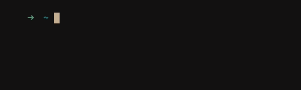
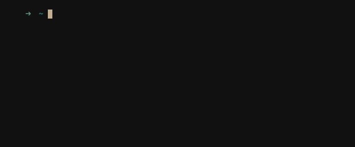
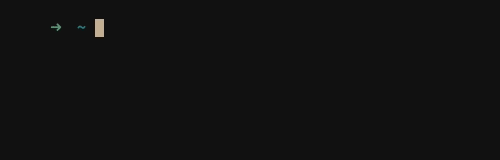
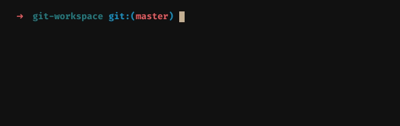

This project was started as a pet project in [Clearcode](https://github.com/ClearcodeHQ/jira-git-flow)

# gfl

The `gfl` is simple CLI tool to manage Jira flow along with
the git repository.

It allows to manage Jira issues, stories and subtasks in a simple way.
When new task is created the git branch with suitable name will be created
in local repository.

Tasks workflow (open -> progress -> review -> done) is managed with cli
commands.

## Installation

Clone the repository and run `pip install .` either with `--user` flag or
within virtualenv.

## Usage

Available commands:

````
    Usage: gfl [OPTIONS] COMMAND [ARGS]...

    Git flow.

    Options:
    --help  Show this message and exit.

    Commands:
    bug          Create (work on) bugfix.
    commit       Commit for issue
    credentials  Manage JIRA credentials.
    finish       Finish story
    init         Init workspace.
    instances    Manage JIRA instances.
    projects     Manage JIRA projects.
    publish      Push branch to origin
    resolve      Resolve issue
    review       Move issue to review
    start        Start story/task
    status       Get work status
    story        Create a story
    subtask      Create (work on) subtask.
    task         Create (work on) task
    workflows    Manage issue workflows.
    workon       Work on story/issue.
    workspaces   Manage workspace.
````

## Setup

To work with `gfl` you need to setup JIRA instance, credentials,
workflow and project.

### Credentials

To authenticate with JIRA instance you'll need to setup credentials.

To add new credentials run:

```
gfl credentials add
```
<details><summary>Example</summary>

  

</details>

### Instances

You can work with many JIRA instances. To add instance run:

```
gfl instances add
```

<details><summary>Example</summary>

  

</details>

### Workflows

Each JIRA projects could have it's own workflow. Workflow describes available
issue types, statuses and transitions.

As workflows may vary you'll need to map *gfl* resources with remote ones.

If *assign during transition* is set, the issue will be assigned to user during
transitions.

To add new workflow run:

```
gfl workflows add
```

<details><summary>Example</summary>

  

</details>

### Projects

JIRA issues live in a specific project. Each projects has its key and workflow.

To add a new project run:

```
gfl projects add
```

<details><summary>Example</summary>

  

</details>

### Workspaces

Each git workspace should be initialized to be used with gfl. To initialize
workspace simply run:

```
gfl init
```

**NOTE:** Workspace is coupled with JIRA project. All actions performed in
specific workspace would be comply with project workflow.

<details><summary>Example</summary>

  

</details>

## Working on issues

To start working on existing JIRA issue run:

```
gfl workon SEARCH_PHRASE
```

The *SEARCH PHRASE* is a phrase you want to search in remote issues summary. If
one issue with specific phrase will be found you'll start working on it
immediately. If multiple ones will be found you'll choose correct by CLI.

**NOTE:** gfl by default searches only last 100 issues in project. If you want
to increase value change *max_results* in config file.

### Searching issue by key

If you want to choose issue by specific key run workon with `-k` argument.

```
gfl workon -k PROJ-123
```

### Work on local issue

If an issue is available in local state simply run command without any
arguments.



### Branch naming

The `gfl` will name your branch automatically according to prefixes set in workflow.

## Getting work status

To get current work status run:

```
gfl status
```

## Managing issue flow

You can manage the issue flow with commands:

* start
* review
* resolve

Example:


## Creating new issue

You can create new issue by running one of following commands:

* `story`
* `subtask`
* `task`
* `bug`

After successful creation you will start working on issue immediately.

## Managing git repository

## Commiting changes

To make a commit for current issue run:

```
gfl commit
```

Issue key will be added to the beginning of a commit message.

## Publishing branch

To publish current issue branch on remote repository run:

```
gfl publish
```

## Customization

Tool can be customized by editing `~/.config/gfl/config.json` file.
The file is created during first run.

### Badges

Each status has a bagde to display in terminal.
Badges along with their colors can be defined in config.

### Max results

To increase max results during search increase *max_results* parameter.
